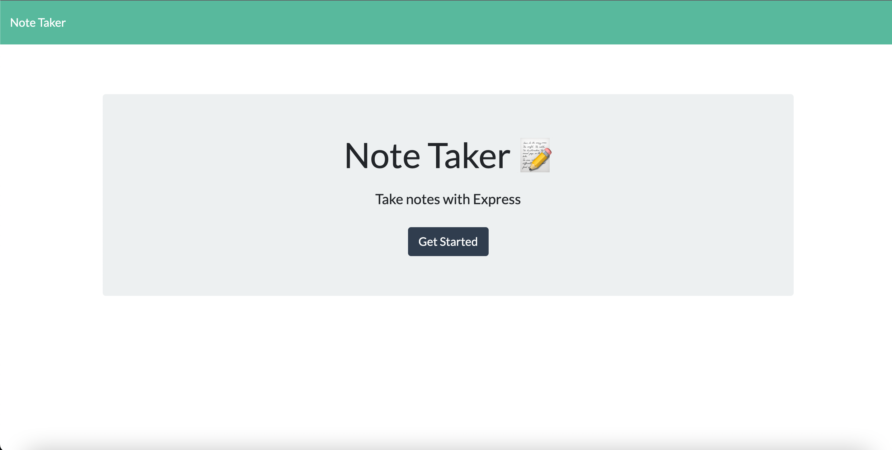
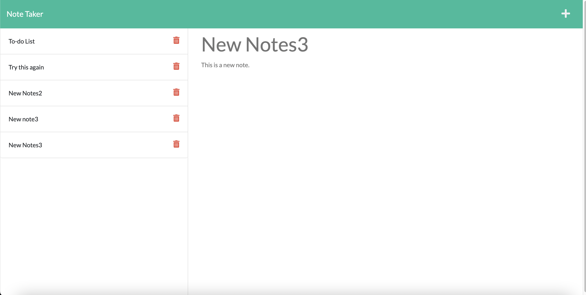
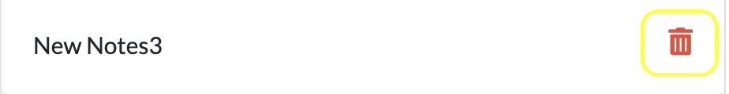

# Magic Note Taker

## DESCRIPTION

I decided to create this app because I think it will help people organize their day, and create a good list of things to get done each day. Future iterations of this app could include the ability to check items off that have been completed. You can easily create To-Do items in the app, and delete them using the trash can button, but I think having the option to check things off would be helpful too.

## INSTALLATION 

In order to install this app it is pretty simple. All you need to do is clone all the code from my Github repository. Then you can install all the npm dependencies using "npm i" while in the main directory of the app.

## USAGE

Next, you can run "npm start" in your terminal while in the same directory as the app. If you would like, you could also run "node server.js" to initiate the server.

Then you will need to open your web browser (Chrome, Safari, or Mozilla) and navigate to http://localhost:3001 in your browser. Then you should load the note taker main page (shown below).

Once you are at the main page of the app, you can click on the button that says "get started". This will load the notes page, where you can take down and save notes.

At this point you can enter a note title in the section labeled "Note Title", and a note in the section labeled "Note Text". Once you are done with your note, you can click on the floppy disk symbol in the upper right corner of the page. Once you click on this floppy disk, your note will be saved, and it will appear on the left side of the page. You can then retrieve the Note Title and Note Text of your note by clicking on it in the notes list on the left side of the page.

If you want to just create a new note, you can click on the "+" symbol in the upper right of the page. This will give you the opportunity to enter a new note in the right half of the page.

If you wish to delete a note, you can click on the small trashcan image and the image will be deleted from your notes list. 
 

## LICENSE

## BADGES

